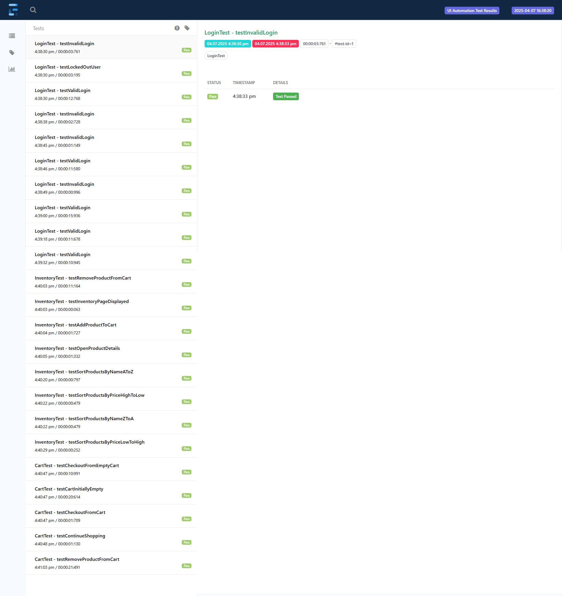
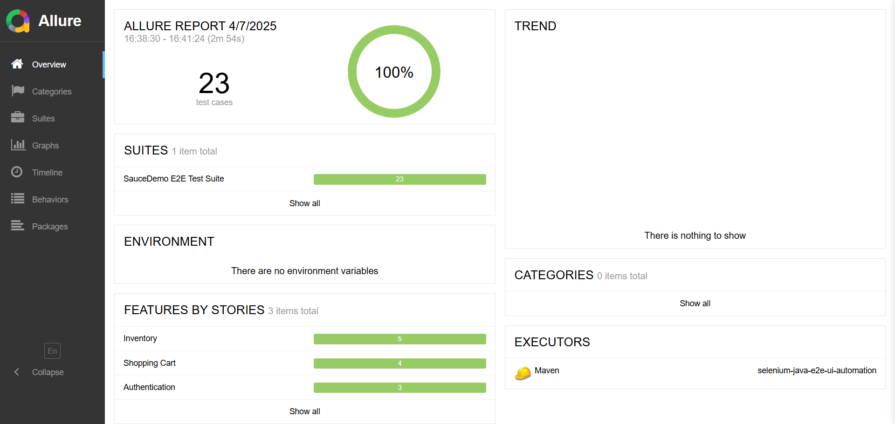
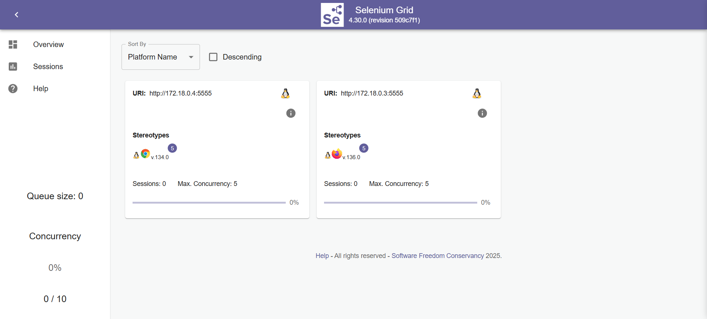
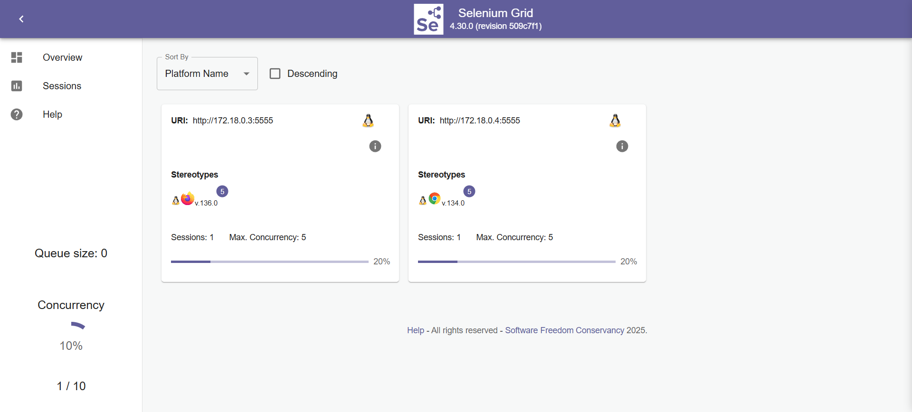
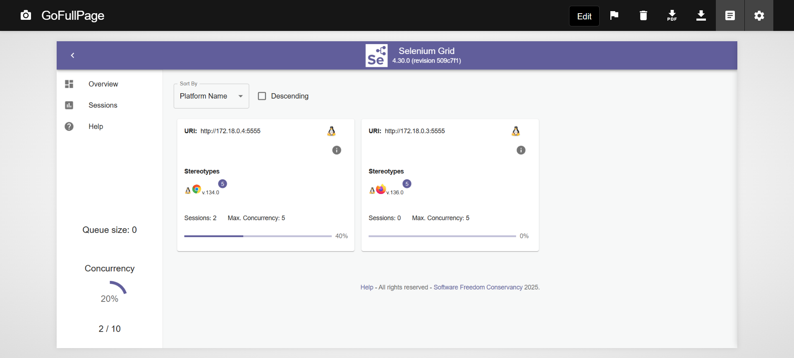
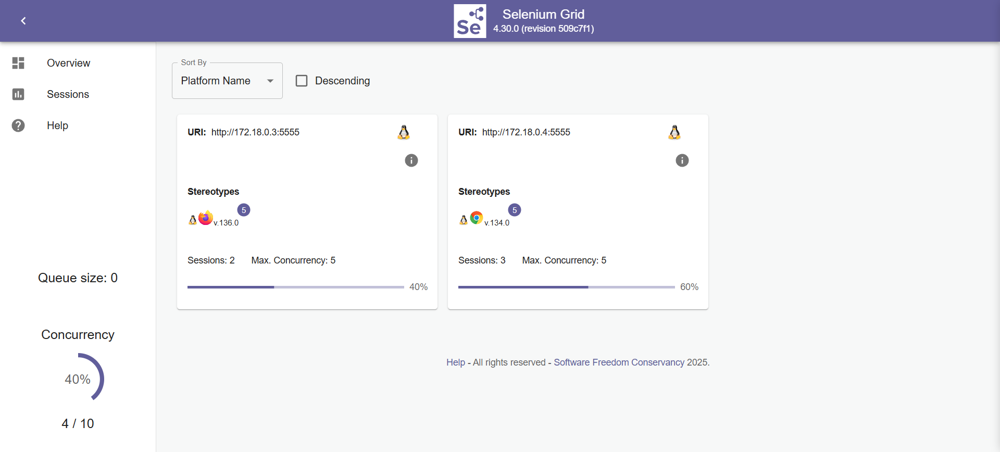

# Selenium Java E2E UI Automation Framework

A robust end-to-end UI testing framework for automating web applications using Selenium WebDriver, Java, and TestNG. This framework implements the Page Object Model (POM) design pattern to create maintainable and scalable test automation.

## Table of Contents

- [Features](#features)
- [Prerequisites](#prerequisites)
- [Project Structure](#project-structure)
- [Core Concepts & Architecture](#core-concepts--architecture)
  - [Design Patterns](#design-patterns-implemented)
  - [WebDriver Initialization & Management](#webdriver-initialization--management)
  - [TestNG Listeners](#testng-listeners)
  - [Reporting & Logging](#reporting--logging)
- [Configuration](#configuration)
- [Running Tests](#running-tests)
  - [Local Execution](#local-execution)
  - [Selenium Grid Execution](#selenium-grid-execution)
- [Viewing Reports](#viewing-reports)
- [Selenium Grid Setup and Usage](#selenium-grid-setup-and-usage)
- [Getting Started & Adding New Tests](#getting-started--adding-new-tests)
- [Best Practices Used](#best-practices-used)
- [Browser Support](#browser-support)
- [Future Enhancements](#future-enhancements)
- [Contributing](#contributing)
- [License](#license)

## Features

- **Page Object Model (POM)**: Structured page classes (`src/main/java/.../pages`) with encapsulated elements and actions for maintainability. Includes `BasePage` for common actions and `components` for reusable UI parts.
- **Driver Factory**: Centralized WebDriver management (`DriverFactory`) using `ThreadLocal` for thread safety during parallel execution.
- **Configuration Management**: Externalized configuration via `src/main/resources/config.properties` loaded by `FrameworkConfig`.
- **Parallel Test Execution**: Configurable via TestNG (`parallel="methods"` in `testng.xml`), supported by thread-safe WebDriver handling.
- **Cross-Browser Testing**: Support for Chrome, Firefox, and Edge configured via `config.properties` or system property. Easily extendable.
- **TestNG Listeners**:
    - `TestListener`: Integrates with ExtentReports and Allure, logs test status, and captures screenshots on failure.
    - `RetryAnalyzer`: Implements logic to retry failed tests once.
    - `AnnotationTransformer`: Applies the `RetryAnalyzer` to tests dynamically.
- **Dual Reporting**: Integrated Extent Reports and Allure Reports for comprehensive test documentation.
- **Screenshot Capture**: Automatic screenshots on test failures via `TestListener`, attached to both Extent and Allure reports.
- **Logging**: Detailed logging using SLF4J facade with Log4j2 implementation (configured via `src/main/resources/log4j2.xml`).
- **WebDriverManager**: Automatic download and management of WebDriver binaries.
- **Headless Execution**: Default execution mode is headless. Headed mode can be triggered via a system property (`-DrunMode=headed`).
- **Data-Driven Testing**: Examples using TestNG `@DataProvider`.

## Prerequisites

- **Java Development Kit (JDK)**: Version 11 or higher.
- **Apache Maven**: Version 3.6 or higher (for building and running tests).
- **Supported Web Browser**: Chrome, Firefox, or Edge installed for local headed execution.
- **Allure Commandline** (Optional, for viewing Allure reports): Installation instructions [here](https://docs.qameta.io/allure/#_installing_a_commandline).

## Project Structure

```
selenium-java-e2e-ui-automation/
├── src/
│   ├── main/
│   │   ├── java/
│   │   │   └── com/test/automation/      # Main framework code
│   │   │       ├── config/               # Configuration loading
│   │   │       ├── constants/            # Application constants
│   │   │       ├── enums/                # Enumerations
│   │   │       ├── factory/              # WebDriver creation
│   │   │       ├── listeners/            # TestNG listeners
│   │   │       ├── pages/                # Page Object Model classes
│   │   │       │   ├── base/             # BasePage with common
│   │   │       │   └── components/       # Reusable page components
│   │   │       └── utils/                # Utility classes 
│   │   └── resources/
│   │       ├── config.properties       # Framework configuration file
│   │       └── log4j2.xml              # Logging configuration
│   └── test/
│       ├── java/
│       │   └── com/test/automation/
│       │       └── tests/                # Test classes
│       │           └── BaseTest.java     # Base class for all tests
│       │
│       └── resources/
│           ├── testdata/               # Test data files (if any)
│           └── testng.xml              # TestNG suite definition
├── test-output/                        
│   ├── extent-reports/                 # Directory for ExtentReports
│   └── allure-results/                 # Directory for Allure test
├── pom.xml                               # Maven project configuration
└── README.md                             # This file
```
*(Note: The `testng.xml` path might vary based on project setup)*

## Core Concepts & Architecture

### Design Patterns Implemented

- **Page Object Model (POM)**: The core pattern. Separates UI interaction logic (in page classes) from test case logic (in test classes). Reduces duplication and improves maintainability.
- **Factory Pattern**: Used in `DriverFactory` to abstract the creation of `WebDriver` objects. It handles browser selection, local vs. Grid instantiation, and configuration application (headless/headed, options).
- **Singleton Pattern**: Used in `FrameworkConfig` and `ExtentManager` to ensure a single, globally accessible instance manages configuration properties and the ExtentReports engine, respectively.
- **ThreadLocal Pattern**: Employed within `DriverFactory` (`driver` and `wait` ThreadLocal variables). This is crucial for parallel execution, ensuring each test thread gets its own isolated `WebDriver` and `WebDriverWait` instance, preventing race conditions and state conflicts.
- **Builder Pattern** (Fluent API): Used in some page objects (e.g., `CheckoutInformationPage`) to allow for method chaining when performing sequences of actions, making test code more readable.

### WebDriver Initialization & Management

- **`DriverFactory`**: The central class responsible for `WebDriver` lifecycle.
    - **Initialization (`getDriver()` -> `initializeDriver()`):**
        - Checks the `ThreadLocal` variable. If no driver exists for the current thread, it calls `initializeDriver()`.
        - Reads configuration (`FrameworkConfig`) to determine browser type (`browser` property) and whether to use Selenium Grid (`use.grid` property).
        - Reads the `runMode` system property (defaulting to `headless`) to decide whether to add headless arguments.
        - Uses `WebDriverManager` to automatically download and set up the appropriate driver binary (chromedriver, geckodriver, etc.) for local execution.
        - Creates either a local `WebDriver` (`ChromeDriver`, `FirefoxDriver`, etc.) or a `RemoteWebDriver` pointing to the Grid URL, applying configured options (headless, password manager disabled, etc.).
        - Stores the created `WebDriver` instance in the `ThreadLocal` variable.
        - Configures implicit waits and timeouts.
    - **Retrieval (`getDriver()`):** Returns the `WebDriver` instance associated with the current thread from `ThreadLocal`.
    - **Cleanup (`quitDriver()`):**
        - Retrieves the driver from `ThreadLocal`.
        - If it exists, attempts to close all browser windows and then calls `driver.quit()`.
        - Includes error handling for the quit process.
        - **Crucially**, uses a `finally` block to *always* remove the `WebDriver` and `WebDriverWait` instances from `ThreadLocal` for the current thread, preventing memory leaks.
- **`BaseTest`**:
    - The `@BeforeMethod` (`setup`) calls `DriverFactory.getDriver()` to ensure a driver is ready for the current thread before each test method runs. It then navigates to the base URL.
    - The `@AfterMethod` (`tearDown`) calls `DriverFactory.quitDriver()` to close the browser and clean up the `ThreadLocal` variable after each test method completes (pass or fail).

### TestNG Listeners

Listeners intercept TestNG events to add custom behavior:

- **`TestListener` (`listeners/TestListener.java`)**:
    - Implements `ITestListener`.
    - **Reporting:** Creates test entries in ExtentReports (`onTestStart`) and logs status (Pass/Fail/Skip) with labels (`onTestSuccess`, `onTestFailure`, `onTestSkipped`). Also integrates with Allure by using `@Step` annotations in page/test methods.
    - **Screenshots:** On test failure (`onTestFailure`), it attempts to get the current `WebDriver` instance, take a screenshot using `TakesScreenshot`, and attaches it as a Base64 string to the ExtentReport and as a byte array attachment to the Allure report.
    - **Logging:** Logs test start/finish events.
    - **Cleanup:** Previously called `DriverFactory.quitDriver()` in `onFinish`, but this was removed as cleanup is handled by `BaseTest.@AfterMethod`. It still calls `extent.flush()` in `onFinish` to write the ExtentReport file.
- **`RetryAnalyzer` (`listeners/RetryAnalyzer.java`)**:
    - Implements `IRetryAnalyzer`.
    - Contains the logic to retry a failed test. It keeps a counter per test thread and retries if the count is less than `MAX_RETRY_COUNT` (currently set to 1, meaning one retry).
- **`AnnotationTransformer` (`listeners/AnnotationTransformer.java`)**:
    - Implements `IAnnotationTransformer`.
    - Registered in `testng.xml`.
    - Its `transform` method is called by TestNG for each test method. It sets the retry analyzer for each test method to be an instance of `RetryAnalyzer`, effectively enabling the retry mechanism for all tests.

### Reporting & Logging

- **Reporting:**
    - **ExtentReports:** Setup via `utils/ExtentManager.java` (Singleton pattern). The `TestListener` interacts with this manager to create tests and log results. The final HTML report is generated when `extent.flush()` is called in `TestListener.onFinish`. Screenshots are embedded as Base64.
    - **Allure Reports:** Leverages `@Step`, `@Description`, `@Severity`, `@Feature`, `@Story` annotations in test and page object methods. `TestListener` attaches screenshots on failure using `@Attachment`. The raw XML/JSON results are generated during the test run (`test-output/allure-results/`). A separate command (`allure serve` or `mvn allure:serve`) is needed to generate the interactive HTML report from these results.
- **Logging:**
    - Uses **SLF4J** as the logging facade (see `@Slf4j` annotation via Lombok).
    - Uses **Log4j2** as the logging implementation. Configuration is controlled by `src/main/resources/log4j2.xml`, defining appenders (e.g., console, file), log levels, and formatting patterns.

## Configuration

Framework behavior is controlled via `src/main/resources/config.properties`. Key properties include:

- `base.url`: The base URL of the application under test.
- `browser`: The default browser to use (`chrome`, `firefox`, `edge`).
- `implicit.wait.seconds`, `page.load.timeout.seconds`, `script.timeout.seconds`: Default wait times.
- `use.grid`: Set to `true` to run tests on Selenium Grid, `false` for local execution (default).
- `grid.url`: The URL of the Selenium Grid Hub (used only if `use.grid=true`).

*Note: The `headless` property in `config.properties` is currently ignored. Headless/headed mode is controlled via the `runMode` system property as described below.*

## Running Tests

Tests are executed using Maven from the project's root directory. The default behavior is to run **headless** unless specified otherwise.

### Local Execution

**1. Run All Tests:**
   Executes all tests found by TestNG (as configured in `testng.xml` or via Surefire plugin defaults).
   ```bash
   # Run headless (default)
   mvn clean test

   # Run headed (visible browser)
   mvn -DrunMode=headed clean test
   ```

**2. Run a Specific Test Class:**
   Use the `-Dtest` parameter followed by the class name.
   ```bash
   # Run LoginTest class headless
   mvn -Dtest=LoginTest clean test

   # Run LoginTest class headed
   mvn -Dtest=LoginTest -DrunMode=headed clean test
   ```
   *(Replace `LoginTest` with the desired class name. Make sure it's the simple class name, not the fully qualified name.)*

**3. Run a Specific Test Method:**
   Use the `-Dtest` parameter with the format `ClassName#methodName`.
   ```bash
   # Run testLoginWithValidCredentials method in LoginTest class headless
   mvn -Dtest=LoginTest#testLoginWithValidCredentials clean test

   # Run testLoginWithValidCredentials method in LoginTest class headed
   mvn -Dtest=LoginTest#testLoginWithValidCredentials -DrunMode=headed clean test
   ```
   *(Replace `LoginTest` and `testLoginWithValidCredentials` accordingly)*

**4. Run with a Specific Browser (Overrides config.properties):**
   Use the standard `-Dbrowser` system property (if `DriverFactory` is adapted to read it, otherwise modify `config.properties`). *Currently, the framework primarily reads the browser from `config.properties`.* To easily override, you might need to enhance `DriverFactory` or rely on profile-based configurations in Maven. A common way is:
   ```bash
   # Example if DriverFactory reads system property 'browser' (requires code change)
   # mvn clean test -Dbrowser=firefox

   # Or, modify config.properties before running
   ```

### Selenium Grid Execution

This framework supports running tests remotely on a Selenium Grid for parallel execution across different browser/OS combinations.

**Prerequisites:**
   - A running Selenium Grid instance (Version 4 recommended). You can set this up using Docker or run the server JARs directly. Refer to the [Official Selenium Grid Documentation](https://www.selenium.dev/documentation/grid/).
   - Ensure the Grid Hub URL is accessible from where you run the Maven command.

**Configuration:**
   1.  Edit `src/main/resources/config.properties`.
   2.  Set `use.grid=true`.
   3.  Verify or update `grid.url` to match your Selenium Grid Hub address (e.g., `http://your-grid-hub-ip:4444`).

**Running Tests on Grid:**
   Once `use.grid=true` is set in `config.properties`, use the standard Maven commands. The `DriverFactory` will detect `use.grid=true` and automatically create `RemoteWebDriver` instances pointing to the specified `grid.url`.
   ```bash
   # Run all tests defined in testng.xml on the configured Grid
   # Browser type is determined by capabilities requested or Grid default
   mvn clean test

   # Run a specific class on the Grid
   mvn -Dtest=InventoryTest clean test
   ```
   *Note: Whether the browser runs headed or headless on the Grid depends entirely on how the Grid **nodes** are configured when they register with the Hub. The `-DrunMode` flag only affects local execution.*

## Viewing Reports

After test execution, you can find the following reports in the `test-output` directory:

1. **Extent Reports**: Located in `test-output/extent-reports/`
   - Open the HTML file in a web browser
   - Provides detailed test execution information, screenshots, and logs

   <div align="left">
    <p><strong>Extent Reports</strong></p>
    
    </div>

2. **Allure Reports**: Located in `test-output/allure-results/`
   - Generate report using: `mvn allure:report`
   - View report using: `mvn allure:serve`
   - or alternative do `allure serve test-output/allure-results/`
   - Provides comprehensive test execution details and trends

   <div align="left">
    <p><strong>Allure Reports</strong></p>
    
    </div>

## Selenium Grid Setup and Usage

This framework supports running tests on a Selenium Grid, allowing for distributed test execution across multiple browsers and machines.

### Local Grid Setup

1. **Prerequisites**:
   - Docker installed on your machine
   - Docker Compose installed

2. **Start the Grid**:
   ```bash
   # Navigate to the project root directory
   cd selenium-java-e2e-ui-automation
   
   # Start the Grid using Docker Compose
   docker-compose up -d
   ```

<div align="left">
    <p><strong>Grid View</strong></p>
    
</div>

3. **Verify Grid Status**:
   - Open your browser and navigate to: `http://localhost:4444/ui`
   - You should see the Grid console showing available nodes (Chrome and Firefox)

### Running Tests on Grid

1. **Configuration**:
   - Set `use.grid=true` in `src/main/resources/config.properties`
   - Set `grid.url=http://localhost:4444` in the same file
   - Alternatively, override these settings via command line

2. **Simple Test Execution**:
   ```bash
   # Run tests on Chrome using Grid (default configuration)
   mvn clean test "-Dtest=LoginTest" "-Dbrowser=chrome"
   
   # Run tests on Firefox using Grid
   mvn clean test "-Dtest=LoginTest" "-Dbrowser=firefox"
   ```

3. **Optional: Override Grid Configuration**:
   If you need to override the default Grid settings, you can use command line parameters:
   ```bash
   # Example: Run tests against a different Grid URL
   mvn clean test "-Dtest=LoginTest" "-Dbrowser=chrome" "-Dgrid.url=http://different-grid:4444"
   
   # Example: Switch to local execution temporarily
   mvn clean test "-Dtest=LoginTest" "-Dbrowser=chrome" "-Duse.grid=false"
   ```

4. **Grid Configuration Options**:
   - `use.grid`: Set to `true` to use Grid, `false` for local execution (default: true)
   - `grid.url`: URL of the Grid Hub (default: `http://localhost:4444`)
   - `browser`: Browser to use (`chrome` or `firefox`)

5. **Monitoring Grid Execution**:
   - Watch the Grid console at `http://localhost:4444/ui` during test execution
   - View live sessions and node status
   - Monitor test execution in real-time

<div align="left">
    <p><strong>Grid Run - 1 concurrent session</strong></p>
    
</div>

<div align="left">
    <p><strong>Grid Run - 2 concurrent session</strong></p>
    
</div>

<div align="left">
    <p><strong>Grid Run - 4 concurrent session</strong></p>
    
</div>

### Grid Architecture

The framework uses a Hub-Node architecture:
- **Hub**: Central point that receives test requests
- **Nodes**: Browser instances that execute the tests
- **Docker Setup**: Uses separate containers for Hub, Chrome Node, and Firefox Node

### Troubleshooting Grid Issues

1. **Grid Not Starting**:
   - Check Docker service status
   - Verify port 4444 is not in use
   - Check Docker logs: `docker-compose logs`

2. **Connection Issues**:
   - Verify Grid URL is correct
   - Check if Grid Hub is accessible
   - Ensure nodes are registered with the Hub

3. **Browser Issues**:
   - Check node logs for browser startup problems
   - Verify browser versions are compatible
   - Check Docker container resource limits

## GitHub Actions Implementation

This project includes two GitHub Actions workflows for automated testing:

### 1. Continuous Integration (CI) Tests
Located in `.github/workflows/ci-tests.yml`:
- **Trigger**: Runs automatically on push and pull requests
- **Environment**: Uses local Chrome browser in headless mode
- **Steps**:
  - Set up Java 11
  - Install Chrome browser
  - Run all tests
  - Upload Extent and Allure reports
- **Reports**: Available as workflow artifacts

### 2. Selenium Grid Tests
Located in `.github/workflows/grid-tests.yml`:
- **Trigger**: Manual execution only (workflow_dispatch)
- **Environment**: Selenium Grid with Chrome and Firefox nodes
- **Configuration**:
  - Test class selection
  - Browser selection (Chrome, Firefox, or both)
- **Steps**:
  - Set up Selenium Grid
  - Run tests on selected browser(s)
  - Upload Grid-specific reports
- **Reports**: Available as workflow artifacts with "grid-" prefix

### Running GitHub Actions Workflows

1. **CI Tests**:
   - Automatically runs on push/PR
   - No manual intervention needed
   - View results in Actions tab

2. **Grid Tests**:
   - Manual trigger required
   - Steps to run:
     1. Go to Actions tab
     2. Select "Selenium Grid Tests"
     3. Click "Run workflow"
     4. Select test class and browser
     5. Click "Run workflow"

### Viewing Test Results

1. **CI Test Results**:
   - Navigate to Actions tab
   - Select the latest CI run
   - Download artifacts:
     - `extent-report`: HTML test report
     - `allure-results`: Allure test data

2. **Grid Test Results**:
   - Navigate to Actions tab
   - Select the latest Grid run
   - Download artifacts:
     - `grid-extent-report`: Grid-specific HTML report
     - `grid-allure-results`: Grid-specific Allure data

### Workflow Artifacts

Both workflows generate and upload:
- Extent Reports (HTML format)
- Allure Results (for detailed analysis)
- Job summaries with direct links to artifacts

Artifacts are retained for:
- CI Tests: 7 days
- Grid Tests: 5 days

## Getting Started & Adding New Tests

### Installation & Setup

1.  **Clone:** `git clone <repository-url>`
2.  **Navigate:** `cd selenium-java-e2e-ui-automation`
3.  **Build:** `mvn clean install -DskipTests` (Installs dependencies and builds the project without running tests)

### Adding New Tests

1.  **Create Page Object(s):** (If the page/component doesn't exist in `src/main/java/.../pages`)
    -   Create a new Java class extending `BasePage`.
    -   Use `@FindBy` annotations to locate elements.
    -   Initialize elements in the constructor using `PageFactory.initElements(driver, this);`.
    -   Add methods representing user actions on the page, annotated with `@Step` for Allure reporting.
2.  **Create Test Class:** (In `src/test/java/.../tests`)
    -   Create a new Java class extending `BaseTest`.
    -   Use TestNG annotations (`@Test`, `@BeforeMethod`, etc.).
    -   Use Allure annotations (`@Feature`, `@Story`, `@Description`, `@Severity`).
    -   Instantiate necessary Page Objects and call their action methods.
    -   Use TestNG `Assert` methods for verification.
3.  **Add to TestNG Suite:** (Optional, if you want it included in the default `mvn clean test` run via `testng.xml`)
    -   Edit your `testng.xml` file (e.g., `src/test/resources/testng.xml`).
    -   Add a `<class>` entry pointing to your new test class within the appropriate `<test>` section or create a new `<test>` section.

## Best Practices Used

- **Clear Separation of Concerns:** Test logic (`tests`), UI interaction (`pages`), driver management (`factory`), and configuration (`config`) are distinctly separated.
- **Thread-Safe WebDriver Management:** Using `ThreadLocal` in `DriverFactory` ensures reliable parallel execution.
- **Descriptive Naming:** Test methods, page object methods, and variables use clear names.
- **Explicit Waits:** Using `WebDriverWait` (via `BasePage` helper methods like `waitForElementVisible`, `waitForElementClickable`) instead of hardcoded `Thread.sleep()`.
- **Robust Element Interaction:** The `click` and `type` methods in `BasePage` include handling for common exceptions like `StaleElementReferenceException` and `ElementClickInterceptedException` with retries or fallbacks.
- **Configuration over Hardcoding:** Using `config.properties` for URLs, timeouts, browser settings, etc.
- **Comprehensive Reporting & Logging:** Dual reports (Extent, Allure) and detailed logging provide good visibility into test execution.
- **Code Reusability:** `BasePage` and `BaseTest` provide common functionalities inherited by page objects and test classes.
- **Dependency Management:** Using Maven (`pom.xml`) for managing project dependencies.

## Browser Support

- Chrome (default, configured in `config.properties`)
- Firefox
- Edge
*(Support for Safari is possible but may require additional configuration/testing on macOS)*

## Future Enhancements

- Cloud testing integration (Sauce Labs, BrowserStack)
- Visual regression testing integration

## Contributing

1. Fork the repository
2. Create a feature branch: `git checkout -b feature/your-new-feature`
3. Commit your changes: `git commit -am 'Add some feature'`
4. Push to the branch: `git push origin feature/your-new-feature`
5. Submit a pull request

## License

This project is licensed under the MIT License. 